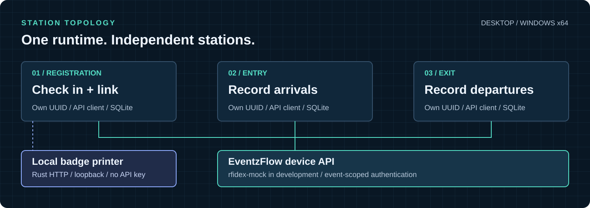
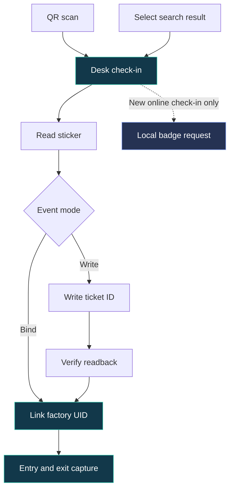
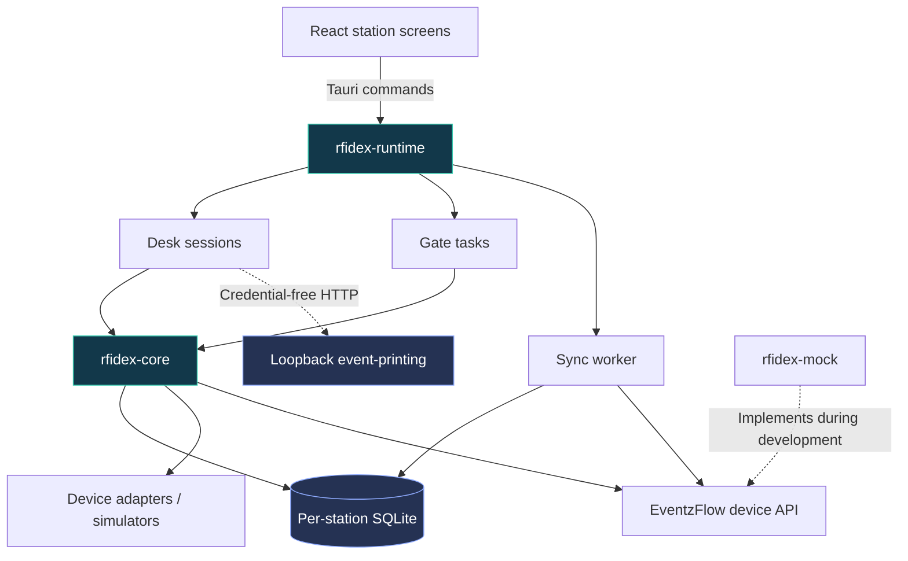

<div align="center">


# RfiDex

**Scan a ticket, tag a sticker, walk through a gate — online or off.**

RFID desk and gate software for EventzFlow: ticket check-in, badge printing,<br/>
sticker registration and entry/exit capture, with a local cache and durable queue when the connection drops.

[](https://github.com/LearningTigers-Sdn-Bhd/rfidex/actions/workflows/ci.yml)
[](https://github.com/LearningTigers-Sdn-Bhd/rfidex/releases/latest)


[**Download**](https://github.com/LearningTigers-Sdn-Bhd/rfidex/releases/latest) · [**Try it**](#try-it) · [**Quick start**](#quick-start) · [**Architecture**](#architecture) · [**Operations**](#operations) · [**Status**](#development-status)

</div>

---

## Technology


Rust owns runtime outcomes, validation and operator error messages. React renders the station screens; Tauri provides the native command boundary. SQLite stores each station's cache and queued work. The mock API uses axum; production HTTP calls use reqwest.

## Capabilities

| Area | Functionality |
| :-- | :-- |
| **Registration desk** | Keyboard-wedge QR scan; name, email and phone search; ticket check-in; existing-check-in detection |
| **Sticker registration** | Bind factory UID, or write ticket ID and verify readback; explicit confirmation and reason for replacement |
| **Badge printing** | Per-desk local printer address; health check; automatic first-check-in attempt; manual Reprint; independent sticker processing |
| **Entry and exit gates** | Configured station direction; guest/result display; record-based and live-inventory simulators; repeat-read debounce |
| **Offline operation** | Local ticket/binding cache; name-only search; durable outbox; retry backoff and idempotent delivery |
| **Multi-station deployment** | Any mix of desk, entry and exit stations on one PC, each with its own UUID, database and API client |
| **Operator support** | Connection/device status, queued-work counts, Problems list, simulator controls and redacted diagnostics export |
| **Windows distribution** | Per-user NSIS installer, WebView2 bootstrapper, separate packaging workflow and signed updater artifacts |



> [!IMPORTANT]
> **Current integration boundary:** development and tests use `rfidex-mock`. Real ECRFID hardware integration is pending; the production EventzFlow RFID backend is on hold. Installer availability and simulated tests do not certify real readers, physical printing or production backend behavior.

<details>
<summary><strong>Documentation index</strong></summary>

- [Try it without building](#try-it)
- [Quick start](#quick-start)
- [Registration workflow](#registration-workflow)
- [Ticket search](#ticket-search)
- [Badge printing](#badge-printing)
- [Architecture and API boundaries](#architecture)
- [Offline guarantees and limits](#offline-operation)
- [Station setup and troubleshooting](#operations)
- [Build, tests and rehearsal](#verification)
- [Windows packaging and updates](#windows)
- [Development status](#development-status)
- [Storage, credentials and diagnostics](#privacy)

</details>

<a id="try-it"></a>

## Try it without building

> [!TIP]
> **For testers on Windows — no Rust or Node needed.**
> 1. From the [latest release](https://github.com/LearningTigers-Sdn-Bhd/rfidex/releases/latest), download `RfiDex_<version>_x64-setup.exe`, `rfidex-mock.exe` and `tickets.json` into one folder, and run the setup (SmartScreen: **More info → Run anyway**).
> 2. In that folder run `rfidex-mock.exe --port 4010 --api-key rfidex_demo_key_0123456789abcdefghij --tickets tickets.json`.
> 3. In RfiDex **Setup**, use server `http://127.0.0.1:4010` and that key, add a desk and a gate, then follow step 3 of the quick start below.
>
> Installed copies update themselves: **Check for updates** / **Update now** in the bottom bar.

<a id="quick-start"></a>

## Quick start

Run a complete simulated desk/entry/exit setup without RFID hardware.

### Prerequisites

- Rust stable with `rustfmt` and `clippy`.
- Current Node.js LTS and **npm**. Committed lockfiles are `Cargo.lock` and `app/package-lock.json`.
- [Tauri 2 host prerequisites](https://v2.tauri.app/start/prerequisites/). Windows x64 is the distribution target; macOS is also used for development.

### 1. Start the mock event server

From the repository root:

```bash
cargo run -p rfidex-mock --locked -- \
  --port 4010 \
  --api-key rfidex_demo_key_0123456789abcdefghij \
  --tickets app/dev/tickets.json \
  --event-name "RfiDex Demo" \
  --mode bind
```

Use `--mode write` to test written sticker payloads. The server binds loopback. The example key and [demo attendees](app/dev/tickets.json) are fictional development data.

### 2. Start the desktop app

In another terminal:

```bash
cd app
npm ci
npm run tauri dev
```

Tauri opens a native window; Vite runs on `127.0.0.1:1420`. An ordinary browser at that URL has no Tauri bridge and displays launch instructions instead of acting as a station.

### 3. Configure stations

1. Open **Setup** and enter `http://127.0.0.1:4010` as the server address.
2. Paste the demo key above and select **Test connection**.
3. Add one desk, one entry gate and one exit gate using simulated devices.
4. Save, open the desk and use **Open simulator** to place a sticker.
5. Scan/type a demo ticket's public ID, link the sticker, then present it at each gate.

Aina and Ben are valid demo guests; Chong is unpaid and Devi is cancelled. Use all four to check success and rejection paths. Demo contacts also support search.

**Printing is optional for this setup.** The RFID mock is not the public ticket API that the separate event-printing app uses. Printer tests use a fake HTTP printer. Real badge output requires event-printing configured against a compatible backend and event slug.

<a id="registration-workflow"></a>

## Registration workflow



### Scan and check in

A keyboard-wedge scanner types into the ticket field and submits with Enter. The desk resolves the ticket and starts normal registration. Search selection uses the same desk-scan path; it does not bypass validity checks.

A newly checked-in guest is eligible for automatic printing. An already-checked-in guest is **not an error**: the desk shows the original check-in time, offers Reprint and continues to sticker registration.

Scanner focus is restored outside deliberate search interaction and native dialogs. Replacement confirmation retains its own input focus and required reason.

### Bind or write

| Mode | Sticker operation | Result |
| :-- | :-- | :-- |
| **Bind** | Read the factory UID | Server/cache links UID to ticket; no ticket payload is written |
| **Write** | Write ticket public ID, then read back and compare | Verified payload plus UID binding as a fallback |

The event determines the mode. The written payload is **20 bytes**, includes a CRC-8 integrity check and contains no attendee profile. A ticket identifier is not a secret; server validation still matters.

Only one sticker may be near the reader. Existing ownership or data triggers a warning and explicit replacement confirmation. A failed write must not become a successful binding.

### Capture entry and exit

Gate direction comes from station configuration. A contradictory device direction is retained for comparison rather than silently changing the station's role. The screen shows the guest, direction and result; unknown stickers are not assigned invented identities.

Record-based and live-inventory sources have different capture behavior. Live-inventory repeats use configured debounce. Offline captures remain **Recorded** until the server supplies an authoritative result.

<a id="ticket-search"></a>

## Ticket search

QR remains the default path. Search handles missing or unreadable tickets using one input and a Name / Email / Phone selector. Requests follow a **300 ms debounce**; late answers must not replace newer input. Click or press Enter on a result to check in that guest.

| Field | Matching | Minimum input |
| :-- | :-- | :-- |
| **Name** | Case-insensitive substring after trimming and collapsing spaces; `%` and `_` are literal characters | 2 characters |
| **Email** | Exact match after trim/lowercase | Contains `@` |
| **Phone** | Digits-only substring after removing a leading `60` or `0` | 4 normalized digits |

`012-345 6789`, `0123456789` and `+60 12 345 6789` can resolve to the same guest.

**Online results:** paid tickets, newest first, maximum ten. Contacts are masked by the server—for example `ah***@example.com` and `•••• 4521`. Selecting a paid but invalid ticket still encounters normal desk validation.

**Offline results:** local name search only, ordered by name. The cache holds no email, phone or first-check-in timestamp. Already-in rows show **Checked in** without inventing a time. Email/phone search displays `Needs internet — search by name or scan QR`.

Online check-in times are the original server timestamps formatted in the PC's local timezone, using a 24-hour clock. Configure the desk PC's timezone correctly.

<a id="badge-printing"></a>

## Badge printing

RfiDex delegates layout and physical printing to **event-printing**, running on the same PC. Rust sends one ticket public ID; the printer app fetches the guest and applies its configured badge layout. RfiDex does not duplicate badge-field mapping.

### Configuration

1. Install and start event-printing on the desk PC.
2. Configure **direct mode**, backend URL and event slug in that app.
3. Set each RfiDex desk's **Printer address** in Setup. Default: `http://127.0.0.1:8000`.
4. Select **Test printer** to request health and show its configured printer name.

Only loopback addresses are accepted. A printer app on another PC is not supported. Health verifies that the app responds, not that a physical printer has produced a badge.

| Scan/print outcome | Desk behavior |
| :-- | :-- |
| **New online check-in** | One automatic print attempt; sticker work proceeds independently |
| **Already checked in** | No automatic print; `Already checked in at HH:MM` and **Reprint badge** |
| **Offline scan queued** | No print; `Offline — press Reprint when back online` |
| **Submission failure or timeout** | `Badge not printed — press Reprint`; no automatic retry |
| **Manual Reprint** | Explicit print request without another check-in |

The timeout is **10 seconds**. A timeout may mean the job printed but the response was lost, so retry is an operator decision. Successful HTTP submission does not prove physical delivery. Printing never blocks sticker processing, but sticker validation/write failures remain independent errors.

```http
GET /health
POST /scan/{public_id}/reprint
```

These requests originate in Rust, not the webview. No EventzFlow API key or station-auth header is sent. The printer client disables redirects and environment proxies. It never calls the printer's check-in endpoint.

Queue drain, cache refresh, heartbeat and restart do **not** trigger printing. Offline work does not produce a badge automatically after reconnecting.

> [!WARNING]
> **Keep the SalesCatalyst print workflow OFF for RfiDex events.** EventzFlow's `ticket.scanned` webhook also fires on RfiDex check-ins and does not identify the initiating app. Both print paths can produce duplicate badges. Keep the workflow as backup only; enable it when staff stop using RfiDex printing.

<a id="architecture"></a>

## Architecture

The workspace separates device-neutral logic, application behavior, simulation and the native interface. Each station retains independent persistent state and authenticated API identity.



| Path | Responsibility |
| :-- | :-- |
| [`crates/rfidex-core`](crates/rfidex-core) | Wire contracts, tag identity, payload codec, device traits, SQLite, API client, sync and station logic |
| [`crates/rfidex-runtime`](crates/rfidex-runtime) | Station ownership/lifecycle, desk sessions, search, print requests, operator outcomes, problems and diagnostics |
| [`crates/rfidex-mock`](crates/rfidex-mock) | In-memory device API, fictional seeds, fault injection and fake printer support for tests |
| [`app/src-tauri`](app/src-tauri) | Native lifecycle, command forwarding, packaging and updater integration |
| [`app/src`](app/src) | Setup, Desk, Gate, Problems and Simulator presentation |

### Contract boundaries

- **Event server:** raw `Authorization: <key>` plus `X-RfiDex-Station: <uuid>` on device requests. One station's client is not reused as another station's identity.
- **Desk check-in:** response distinguishes `checked_in` / `already_checked_in` and includes the first check-in timestamp. Idempotent operation replay returns its original response.
- **Bindings:** explicit replacement confirmation and reason; written payload readback must succeed before binding.
- **Printer:** loopback-only, separate client, no event credential and no badge-layout logic.
- **Cache:** normalized names for offline search, no full email/phone records; existing databases migrate in place.

Wire definitions live in [`contract.rs`](crates/rfidex-core/src/contract.rs), with [JSON fixtures](crates/rfidex-core/tests/fixtures) and [mock integration tests](crates/rfidex-mock/tests). Installed dependency versions are recorded in [Cargo.toml](Cargo.toml), [app/package.json](app/package.json) and their lockfiles.

<a id="offline-operation"></a>

## Offline operation

Offline fallback preserves captured work; it does not replace server authority.

| Invariant | Implementation/limit |
| :-- | :-- |
| **Persist before release** | Gate observations commit to SQLite before supported device release |
| **Durable local writes** | WAL with `synchronous=FULL`; station databases survive process restart |
| **Stable delivery identity** | Queue retries retain operation/delivery IDs and idempotency keys |
| **Controlled recovery** | Backoff rather than continuous retries; server outcomes update stored work |
| **Event isolation** | Queued work is held when the server identifies another event |
| **Visible conflicts** | Rejected/conflicting work enters Problems instead of being silently merged |
| **Honest offline UI** | Gate captures say Recorded, not Accepted; offline desks do not promise printed badges |

A station needs event settings and a populated cache before useful offline desk operation. Search is name-only offline. Physical badge printing requires the printer app to reach its ticket backend.

**Sync now** requests a normal pass and respects retry deadlines. **Dismiss from this list** hides a problem; it does not delete evidence, retry the operation or resolve the conflict.

<a id="operations"></a>

## Operations

### Setup and station identity

There is **no PIN, staff login or per-device credential**. Anyone at the PC can open Setup.

- The saved API key is never returned to the form. Leave the field blank to retain it.
- Server connections require HTTPS except on loopback. Plain HTTP is not supported as a venue-LAN shortcut.
- Changing a gate's entry/exit role requires confirmation.
- The event guard protects pending work from being sent to a different event. With no pending work, a new event can be adopted.
- Removing a station retains its database; preserve its identity and saved work during investigation.

### Updates

The bottom bar shows the installed version. RfiDex checks for a newer release when it opens (silently when there is no internet); **Check for updates** asks again, and **Update now** downloads, stops the stations cleanly and reopens on the new version. Setup and waiting scans are kept.

### Status and troubleshooting

| Display | Meaning | Operator action |
| :-- | :-- | :-- |
| **Accepted · Welcome / Goodbye** | Server confirmed the passage | Continue |
| **Recorded — waiting for the server** | Saved locally; not yet approved | Restore connectivity; monitor sync |
| **Denied** | Unknown, replaced, wrong-event or invalid sticker | Read the reason and resolve at the desk |
| **Problem** | Conflict or unsendable work | Open Problems and investigate |
| **Unauthorized** | Event key rejected, not ordinary offline mode | Verify server/key in Setup |
| **Different event** | Pending work belongs to another event | Restore the correct key; retain station data |
| **Badge not printed** | Failed or uncertain submission | Check printer state before explicit Reprint |

Startup failures retain their code, recovery instructions and **Try again** action. The app uses system fonts and bundled artwork; station operation does not require an external font CDN.

<a id="verification"></a>

## Build and verification

### Local gate

Build frontend assets before commands that build `rfidex-app`: Tauri embeds `app/dist`.

```bash
(cd app && npm ci && npm run build)
cargo fmt --all --check
cargo clippy --workspace --all-targets --locked -- -D warnings
cargo test --workspace --locked
cargo build -p rfidex-app --locked
```

[Normal CI](.github/workflows/ci.yml) stays separate from heavyweight packaging and rehearsal. The badge at the top links to current run results; no fixed passing-test count is maintained in this document.

### Simulated event rehearsal

[`rehearsal.rs`](crates/rfidex-runtime/tests/rehearsal.rs) drives the real runtime and mock over loopback HTTP, not a copied implementation of the workflow.

| Scenario | Scope |
| :-- | :-- |
| **`rehearsal_smoke`** | 12 tickets across two isolated events |
| **`rehearsal_500`** | 500 tickets total: 250 Bind + 250 Write |
| **Full-event assertions** | 500 scan logs, 500 bindings and 2,000 observations, checked using counters and delivery-ID sets |
| **Recovery stages** | Arrival burst, logical lunch outage, restart, queue recovery and independent direction reporting |

```bash
cargo test -p rfidex-runtime --test rehearsal --locked \
  rehearsal_smoke -- --ignored --exact --nocapture

cargo test -p rfidex-runtime --test rehearsal --locked \
  rehearsal_500 -- --ignored --exact --nocapture
```

Both scenarios are ignored during ordinary `cargo test` and run locally or in packaging. Fast fault/wrong-role probes remain in normal tests. Elapsed time depends on host and disk; it is not an RF throughput benchmark.

<details>
<summary><strong>Behavioral coverage and limits</strong></summary>

The [runtime tests](crates/rfidex-runtime/tests) cover station identity, event-selected modes, scan-before-link, single-tag handling, replacement confirmation, offline recovery/conflicts, event guard, rejected keys, diagnostics privacy and stalled-server shutdown.

[Search tests](crates/rfidex-runtime/tests/desk_search.rs) exercise server matching and cache fallback. [Print-flow tests](crates/rfidex-runtime/tests/desk_print.rs) and [printer-client tests](crates/rfidex-runtime/tests/printer.rs) exercise fake HTTP success/failure/timeout without real printer software.

**Not certified by simulation:** RF range, physical UID byte order, device buffer retention, vendor DLL behavior, printer paper delivery or production backend visit/headcount/duration rules. Simulated sticker memory is volatile. A runtime restart does not prove hardware memory persistence; a logical lunch outage is not thirty minutes of wall-clock testing.

</details>

<details>
<summary><strong>Scanner-focus smoke check</strong></summary>

Open a configured simulated Desk in the dev WebView, close dialogs and run:

```js
await (await import('/dev/desk-focus-check.js')).checkDeskFocus()
```

The [helper](app/dev/desk-focus-check.js) checks scanner-focus recovery and simulator-dialog isolation without creating a scan or binding. Still test the actual keyboard-wedge scanner on the event PC.

</details>

<a id="windows"></a>

## Windows packaging and updates

**Target:** Windows 10/11 x64 · per-user NSIS installation · WebView2.

Use [GitHub Releases](https://github.com/LearningTigers-Sdn-Bhd/rfidex/releases) for published test builds. Read the release's version and notes: the current source checkout may contain work not released yet.

| Component | Behavior |
| :-- | :-- |
| **Installer** | Per-user install; mock test server is not bundled into RfiDex |
| **WebView2** | Reuses installed runtime; embedded bootstrapper downloads it if missing, so first installation may require internet |
| **VC runtime** | Current release build links static runtime; packaging fails on unexpected redistributable imports |
| **Updater** | App checks release `latest.json`; update artifacts have verification signatures |
| **Windows code signing** | Installer remains Authenticode-unsigned; updater signing does not remove SmartScreen warnings |

> [!WARNING]
> Verify the release source and published checksums before installing an unsigned test build. Do not disable Windows protections to make an installation pass. Packaging success is not proof of clean-machine installation or updater behavior on every Windows version.

<details>
<summary><strong>Maintainer build and artifact reference</strong></summary>

The [windows-package workflow](.github/workflows/windows-package.yml) runs on manual dispatch or `rfidex-v*` tags. It runs rehearsal, builds NSIS and a separate mock executable, audits native imports, and emits hashes and evidence. Ordinary CI does not build installers.

```bash
gh workflow run windows-package.yml \
  --repo LearningTigers-Sdn-Bhd/rfidex --ref main

gh run list --repo LearningTigers-Sdn-Bhd/rfidex \
  --workflow windows-package.yml --limit 5
```

| Artifact | Contents |
| :-- | :-- |
| `rfidex-windows-x64-unsigned-<sha>-<run-id>` | Installer, updater signature, `SHA256SUMS.txt`, build/rehearsal/import evidence |
| `rfidex-test-tools-<sha>-<run-id>` | `rfidex-mock.exe`, fictional `tickets.json` and test instructions |

```bash
gh run download <run-id> \
  --repo LearningTigers-Sdn-Bhd/rfidex \
  --name rfidex-windows-x64-unsigned-<sha>-<run-id>
```

A matching version-tag run publishes a release and `latest.json`; manual dispatch does not publish that release. Tags must match declared versions. Re-audit native dependencies when vendor DLLs are added. Dispatch, tags and releases are maintainer actions, not normal development steps.

</details>

<a id="development-status"></a>

## Development status

| Phase | Deliverable | Current boundary |
| :-- | :-- | :-- |
| **P0 / P1** | Core, device contracts, codec, SQLite and mock API | Implemented in repository |
| **P2** | Native app, operator flows, simulation and diagnostics | Implemented in repository |
| **P3** | Simulated event rehearsal and Windows packaging | Test harness and packaging workflow available; hardware certification is separate |
| **P7** | Desk search, check-in result and local print integration | Implemented against mock; production backend integration pending |
| **P4** | Real ECRFID readers and captured hardware fixtures | Waiting for hardware |
| **P5** | Production EventzFlow RFID endpoints, visits and reports | On hold; separate approval |
| **P6** | EventzFlow panel RFID views/reports | After P5; outside this desktop repository |

Source availability, published release status and event-readiness are separate milestones. Use the release notes and actual verification evidence for deployment decisions.

<a id="privacy"></a>

## Storage and privacy

> [!WARNING]
> The API key is stored in plain text in `config.json`. Station databases contain attendee names and ticket/binding data. Protection is limited to OS-user file permissions; there is **no encryption at rest**. Use a dedicated Windows account on shared PCs and treat copied configuration/databases as sensitive.

| Host | Data root |
| :-- | :-- |
| **Windows** | `%LOCALAPPDATA%\com.eventzflow.rfidex\` |
| **macOS development** | `~/Library/Application Support/com.eventzflow.rfidex/` |

```text
config.json           Server URL, event key and station configuration
stations/<uuid>.db    One SQLite store per station; retained on removal
exports/              Diagnostics CSV files
```

The saved key never returns to Setup or goes to event-printing. Offline search stores names, not full email/phone contacts. This does not make station data anonymous.

### Diagnostics export

Exports use an explicit allowlist:

```csv
station_id,row_id,kind,state,captured_at,attempts,uid_last4,outcome,problem_code
```

No names, ticket IDs, full UIDs, event key, raw server replies or sticker memory. Cells are quoted and leading spreadsheet formula characters (`= + - @`) are defused. Share the diagnostics export for support, not the entire data directory.

---

**RfiDex** · EventzFlow station software · Windows x64  
[Releases](https://github.com/LearningTigers-Sdn-Bhd/rfidex/releases) · [CI](https://github.com/LearningTigers-Sdn-Bhd/rfidex/actions/workflows/ci.yml) · [Back to top](#rfidex)
