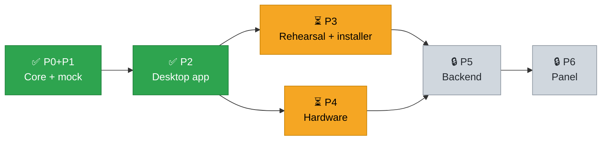
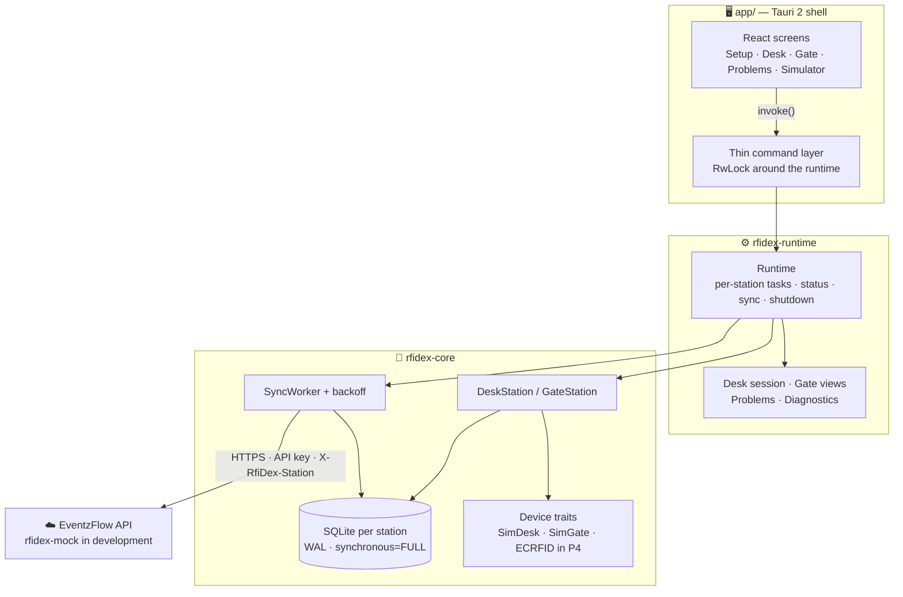
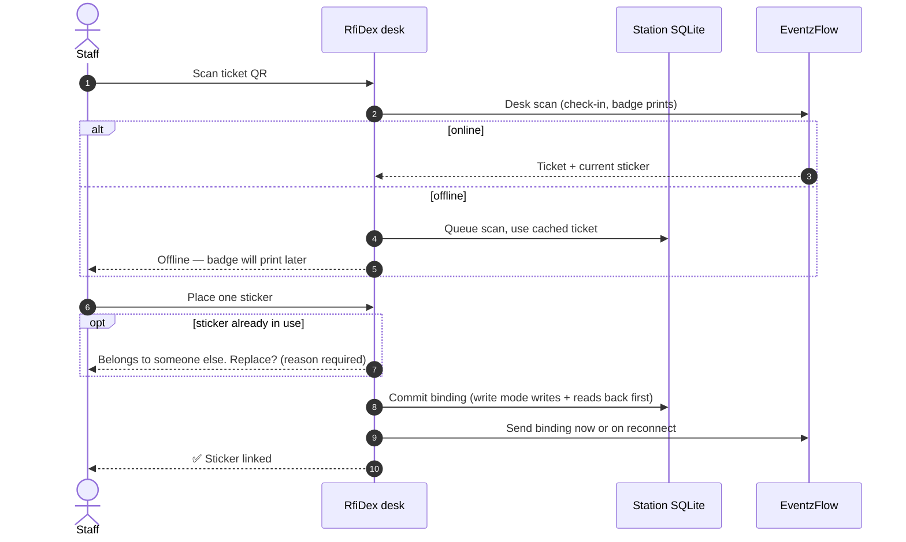

<div align="center">


# RfiDex

**RFID registration desk and entry/exit gates for EventzFlow events.**<br/>
Scan a ticket, tag a sticker, walk through a gate — online or off.

[](https://github.com/LearningTigers-Sdn-Bhd/rfidex/actions/workflows/ci.yml)


[Features](#-features) ·
[Roadmap](#%EF%B8%8F-roadmap) ·
[Architecture](#%EF%B8%8F-architecture) ·
[Development](#-development) ·
[Operations](#-operations) ·
[Privacy](#-privacy)

</div>

---

## ✨ Features

<table>
<tr>
<td width="50%" valign="top">

### 🎫 Registration desk
- Keyboard-wedge QR scan — the scanner types, Enter submits
- **Bind mode:** links the sticker's UID to the ticket
- **Write mode:** writes the ticket onto the sticker, reads it back, *and* binds the UID
- Sticker already in use? Shows whose it is and asks for a reason before replacing
- Two stickers on the reader are refused, never guessed

</td>
<td width="50%" valign="top">

### 🚪 Entry & exit gates
- Large result panel: name, direction, **Welcome** / **Goodbye**
- The station's configured role is authoritative, whatever the reader reports
- Repeat entry, entry without check-in and payload mismatches shown as plain-language warnings
- Unknown sticker is denied — never a made-up name
- Records or live-inventory gates, with per-station debounce

</td>
</tr>
<tr>
<td valign="top">

### 📡 Offline-first
- Every action committed to SQLite **before** it's acknowledged
- Offline passages say **Recorded**, never *Accepted*
- Durable outbox with backoff; the same row flips to accepted on reconnect
- An offline desk says the badge prints when the connection returns — no false promises

</td>
<td valign="top">

### 🛡️ Safe by construction
- One PC runs any mix of desk + gates, each with its **own** store, client and UUID
- **Event guard:** queued work never reaches a different event
- Problems list: dismissing hides, never deletes evidence
- Diagnostics CSV is allowlisted — no names, no full UIDs, no key

</td>
</tr>
</table>

---

## 🗺️ Roadmap

```text
Overall  ███████░░░░░░░░░░░░░░  2 / 6 plans complete
```

| # | Phase | Scope | Status |
|:-:|:--|:--|:--|
| 1 | **P0 + P1** | Core logic, sticker codec, durable outbox, mock EventzFlow server |  |
| 2 | **P2** | Tauri desktop app — setup, desk, gates, problems, simulator |  |
| 3 | **P3** | 500-ticket simulated event rehearsal + Windows installer |  |
| 4 | **P4** | Real ECRFID desk and gate hardware |  |
| 5 | **P5** | EventzFlow backend: RFID endpoints, visits, reports |  |
| 6 | **P6** | EventzFlow panel RFID tab |  |



---

## 🏗️ Architecture



| Crate | Role |
|:--|:--|
| [`rfidex-core`](crates/rfidex-core) | Device-neutral logic: tag keys, 20-byte sticker codec with CRC-8, outbox, sync, desk & gate stations, health |
| [`rfidex-mock`](crates/rfidex-mock) | In-memory EventzFlow device API with fault switches: down, delay, 5xx, hang-after-commit, bad body |
| [`rfidex-runtime`](crates/rfidex-runtime) | All application behaviour and every operator sentence — no Tauri types |
| [`app/`](app) | React + Vite + TypeScript screens and a thin Tauri command layer |

> [!TIP]
> Every decision and every message the operator reads is written in Rust. React only renders.

### 🔄 Desk flow



---

## 🚀 Development

**Prerequisites:** Rust stable with `rustfmt` + `clippy` · Node 20.19+ with npm · [Tauri 2 prerequisites](https://v2.tauri.app/start/prerequisites/) (Xcode command line tools on macOS, WebView2 on Windows).

```bash
# 1 — the mock EventzFlow server (development only)
cargo run -p rfidex-mock -- \
  --port 4010 \
  --api-key rfidex_demo_key_0123456789abcdefghij \
  --tickets app/dev/tickets.json \
  --event-name "RfiDex Demo" \
  --mode bind            # or: write
```

```bash
# 2 — the desktop app
cd app
npm ci
npm run tauri dev        # native window, Vite on 127.0.0.1:1420
```

Then in **Setup**: server `http://127.0.0.1:4010`, the key above, then add one desk plus an entry and an exit gate. Demo tickets are fictional: Aina and Ben (valid), Chong (unpaid), Devi (cancelled).

> [!IMPORTANT]
> The app crate embeds `app/dist`. **Run `npm run build` before any cargo command that builds `rfidex-app`** — CI does the same.

---

## 🧪 Rehearsal and Windows packaging

The P3 acceptance run is a deterministic simulated event driven by the real runtime against the real mock over loopback HTTP — **500 tickets total, in two isolated event runs**: one **Bind** desk and one **Write** desk, each with an entry and an exit gate, run sequentially with separate mock state and separate data roots. Every run covers an entry burst, a logical lunch outage, a station restart, and a direction reported by the reader that contradicts the configured role.

- `rehearsal_smoke` — the same routine with 12 tickets (6 per event). The fast local check while developing the harness.
- `rehearsal_500` — the acceptance run: 250 tickets per event, 500 scan logs, 500 bindings and 2,000 observations, proven from the mock's own counters and delivery-ID sets.

Both are `#[ignore]`d on purpose: the outage and restart stages wait on real retry backoff (1 s doubling to a 60 s cap), so they are far too slow for an ordinary push. They run **only locally and in the windows-package workflow** — ordinary CI stays as it is. Normal `cargo test --workspace` skips both and still runs the fast, explicit-clock fault and wrong-role probes.

> [!NOTE]
> **Status: pending implementation.** The rehearsal harness, the NSIS installer configuration, the `windows-package` workflow and the clean-Windows manual acceptance are all part of Plan 3 and are **not implemented yet**. Nothing on this page is a claim that they ran. The installer will be **unsigned** until a signing decision is made, and the embedded WebView2 bootstrapper **downloads the runtime when it is missing**, so a first install on a machine without WebView2 needs internet.

### ✅ Checks

```bash
(cd app && npm ci && npm run build)
cargo fmt --all -- --check
cargo clippy --workspace --all-targets -- -D warnings
cargo test --workspace          # 108 tests
cargo build -p rfidex-app
```

<details>
<summary><b>📋 Runtime acceptance suite</b> — the real runtime against the real mock over HTTP</summary>
<br/>

| Scenario | Test |
|:--|:--|
| Three stations register under their own UUIDs | `heartbeat_registers_three_stations` |
| Desk follows the event's bind/write mode | `desk_follows_the_event_mode` |
| Link waits for a scan and exactly one sticker | `bind_flow_waits_for_scan_and_one_sticker` |
| A failed scan can't link the previous attendee | `a_failed_scan_cannot_link_the_previous_attendee` |
| Replacement needs a reason and binds only the warned sticker | `confirm_is_required_and_binds_only_the_sticker_that_was_warned_about` |
| Written sticker → Welcome at entry, Goodbye at exit | `written_sticker_yields_welcome_and_goodbye` |
| Offline passage recorded, then accepted on the same row | `an_offline_passage_is_recorded_then_accepted_on_the_same_row` |
| Offline conflict names the holder and can be dismissed | `an_offline_conflict_names_the_holder_and_can_be_dismissed` |
| Event guard parks rows for another event | `event_guard_parks_rows_for_another_event` |
| Rejected key is *unauthorized*, not *offline* | `a_rejected_key_is_unauthorized_rather_than_offline` |
| Connection test changes nothing on the server | `connection_test_reports_and_changes_nothing` |
| Diagnostics keep names and raw UIDs out | `diagnostics_export_keeps_people_and_raw_uid_out` |
| Shutdown finishes even when the server stalls | `shutdown_finishes_even_when_the_server_stalls` |

</details>

---

## 🧭 Operations

### Setup — simple on purpose

There is **no PIN, no staff login and no per-device credential.** Instead:

- the saved API key is **never sent back** to the screen — editing shows a blank field, and leaving it blank keeps the saved key;
- changing a gate between **entry and exit** asks for confirmation, because it changes what every later passage means;
- the server address and key can change at any time, even with work queued — the **event guard** holds that work back from a different event. With an empty queue, a new event is simply adopted.

### Status at a glance

| You see | It means |
|:--|:--|
| 🟢 **Accepted** — Welcome / Goodbye | The server confirmed the passage |
| 🟡 **Recorded — waiting for the server** | Saved locally; sends on reconnect |
| 🔴 **Denied** + reason | Unknown, replaced, wrong-event or invalid sticker |
| 🟠 **Problem** | Conflict or unsendable row — see Problems |
| **Unauthorized** | The server rejected the API key (not the same as offline) |
| **Different event** | The key belongs to another event while work is queued — rows held |

> [!NOTE]
> **Sync now** means "try a normal pass now" — it respects retry backoff.
> **Dismiss from this list** hides a problem; it does not delete, retry or fix it.

### Where data lives

| OS | Path |
|:--|:--|
| 🪟 Windows | `%LOCALAPPDATA%\com.eventzflow.rfidex\` (per user) |
| 🍎 macOS | `~/Library/Application Support/com.eventzflow.rfidex/` |

```text
config.json          server address, API key, station list
stations/<uuid>.db   one SQLite database per station (kept even if the station is removed)
exports/             diagnostics CSV files
```

---

## 🔒 Privacy

> [!WARNING]
> The API key is stored in plain text in `config.json`, and station databases hold attendee names from the ticket cache. They are protected **only by the OS user account's file permissions** — there is no encryption at rest. Use a dedicated Windows account on shared PCs.

The **diagnostics export** is built from an allowlist, so personal data can't leak by accident:

```csv
station_id,row_id,kind,state,captured_at,attempts,uid_last4,outcome,problem_code
```

No names, ticket IDs, full UIDs, API key, server replies or sticker memory. Every cell is quoted and leading formula characters (`= + - @`) are defused.

---

<div align="center">
<sub>Built for EventzFlow · Windows x64 · Simulator-verified, hardware pending (P4)</sub>
</div>
